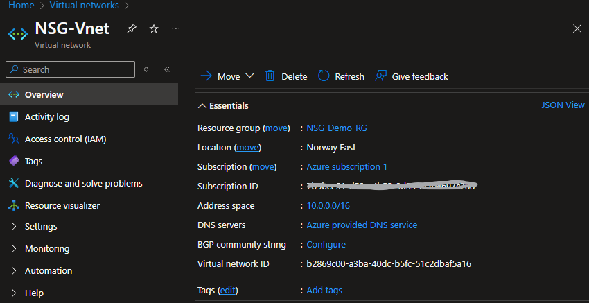

# 🔐 Azure NSG Project: Securing and Inspecting Traffic Between Virtual Machines

This project demonstrates how to set up two Azure Virtual Machines (VM1 and VM2) in a secure virtual network, use Network Security Groups (NSGs) to control traffic between them, and inspect network traffic using Azure Network Watcher — all through the Azure Portal.

---

Project Components

- Two Ubuntu Virtual Machines (VM1 & VM2)
- Virtual Network with Subnet
- Network Security Groups (NSG-VM1 & NSG-VM2)
- Azure Network Watcher
- Python HTTP Server for testing

---

Step-by-Step Guide (Azure Portal Only)

Create a Resource Group

1. Go to Resource groups → + Create
2. Name: `NSG-Demo-RG`
3. Region: `East US` (or your preferred location)
4. Click Review + Create → Create

---

Create a Virtual Network and Subnet

1. Go to Virtual Networks → + Create
2. Name: `NSG-VNet`
3. Resource Group: `NSG-Demo-RG`
4. Region: Same as above
5. Under **IP Addresses**, name the subnet `NSG-Subnet`
6. Leave defaults → Review + Create → Create

---

Create Two Virtual Machines (VM1 & VM2)

Repeat these steps twice: once for VM1, and again for VM2.

- Image: Ubuntu Server 22.04 LTS
- Size: Standard B1s (or similar)
- Username: Your choice
- Auth method: SSH key or password
- Public Inbound Ports: Allow SSH (22)
- Virtual Network: `NSG-VNet`
- Subnet: `NSG-Subnet`

Click Review + Create → Create

---

Create Network Security Groups

1. Search "Network security groups" → + Create
2. Create:
   - `NSG-VM1`
   - `NSG-VM2`
3. Associate each NSG to its corresponding VM’s NIC:
   - Go to VM → Networking → Network Interface
   - Click Network Security Group → Associate

---

Add NSG Rules

Allow SSH (Port 22) on Both NSGs

- Source: Any
- Protocol: TCP
- Destination Port: 22
- Action: Allow
- Priority: 100
- Name: `Allow-SSH`

Allow Port 8080 From VM2 to VM1

1. Get VM2's private IP (from VM2 > Networking).
2. Go to `NSG-VM1` → Inbound security rules → + Add
   - Source: IP Addresses → enter VM2’s private IP
   - Protocol: TCP
   - Destination Port: 8080
   - Action: Allow
   - Priority: 200
   - Name: `Allow-8080-From-VM2`

---

Test Traffic Between VMs

On VM1 (Python Server)

SSH into VM1 and run:

bash
python3 -m http.server 8080

This will start a web server listening on port 8080.

On VM2: Run Curl Test to VM1

In the Azure Portal, go to VM2 > Connect > SSH.
SSH into VM2 using Cloud Shell or your terminal.
Run the following (replace 10.0.0.4 with VM1's private IP):

curl http://10.0.0.4:8080

If successful, you’ll see HTML output like:

<!DOCTYPE HTML PUBLIC "-//W3C//DTD HTML 3.2 Final//EN">
<title>Directory listing for /</title>
...

The NSG attached to VM1 allows traffic on port 8080 only from VM2's private IP, simulating a secure, internal-only service.

Use Azure Network Watcher
Enable Network Watcher
Go to Network Watcher → Select your region

If not enabled, click Enable

Run Connection Troubleshoot
Go to Network Watcher → Connection Troubleshoot

Fill out:

Source VM: VM2

Destination: 10.0.0.4 (VM1's private IP)

Port: 8080

Click Check
